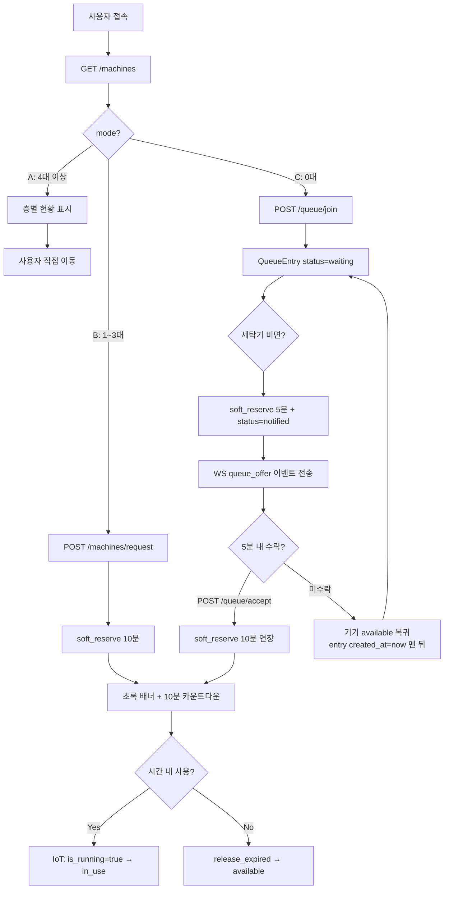
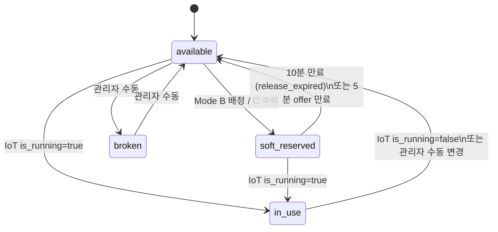

# ESG 기숙사 세탁기 예약 시스템 — 온보딩 & 기술 명세서

> 이 문서는 새 팀원이 코드베이스를 빠르게 파악하고 기여할 수 있도록 작성된 기술 명세서입니다.  
> 비즈니스 목적과 기술 구현을 함께 설명합니다.

---

## 1. Project Overview

### 서비스 핵심 가치

한양대학교 기숙사 세탁기는 선착순 방식으로 운영된다. 사용 가능 여부를 확인하려면 직접 세탁실에 가야 하고, 모두 사용 중이면 허탕 후 반복 방문해야 한다.

ESG는 이 문제를 세 가지 방식으로 해결한다:

1. **실시간 현황 조회** — WebSocket으로 세탁기 상태 변경을 즉시 반영
2. **스마트 배정 시스템** — 가용 세탁기 수에 따라 모드를 자동 전환
3. **원격 대기열** — 세탁실에 직접 가지 않고 앱에서 대기 등록 및 알림 수신

### 타겟 사용자

| 역할 | 설명 |
|------|------|
| 일반 사용자 | 한양대 기숙사 재학생 (@hanyang.ac.kr 이메일 필수) |
| 관리자 | 기숙사 담당자 — 기기 상태 수동 조작, 기기 추가/삭제 |
| IoT 장치 | 세탁기 부착 센서 — `X-Device-Key` 헤더로 인증, 작동 상태 자동 전송 |

---

## 2. Technical Stack & Architecture

### 기술 스택

| 계층 | 기술 | 버전 | 역할 |
|------|------|------|------|
| Frontend | React + TypeScript | React 18, TS 5.4 | SPA |
| 상태관리 | Zustand | 4.5 | 인증 상태, 세탁기 데이터 |
| 라우팅 | React Router | v6 | 클라이언트 사이드 라우팅 |
| Backend | FastAPI | 0.111 | REST API + WebSocket |
| ORM | SQLAlchemy | 2.0 | DB 추상화 |
| 인증 | python-jose + passlib | — | JWT HS256 + bcrypt |
| Rate Limiting | slowapi | 0.1.9 | `/auth/register`, `/machines/request` 제한 |
| Database | PostgreSQL | — | Supabase 관리형 |
| 빌드 도구 | Vite | 5.2 | 프론트엔드 번들링 |
| 테스트 | pytest + vitest | — | 백엔드 42개, 프론트 2개 |

### 전체 시스템 구성

```
┌──────────────────────────────────────┐
│  Browser (Vercel CDN)                │
│  React SPA                           │
│  - Zustand: authStore, machineStore  │
│  - WebSocket 연결 유지               │
└──────────────┬───────────────────────┘
               │ HTTPS / WSS
               ▼
┌──────────────────────────────────────┐
│  Fly.io (Docker, 256MB)              │
│  FastAPI + uvicorn                   │
│                                      │
│  REST API          WebSocket         │
│  /auth/*           /ws               │
│  /machines/*       ConnectionManager │
│  /queue/*          (gender별 in-mem) │
│  /admin/*                            │
│  /iot/*                              │
└──────────────┬───────────────────────┘
               │ SQLAlchemy + psycopg2
               ▼
┌──────────────────────────────────────┐
│  Supabase PostgreSQL                 │
│  (연결 풀링 내장, 500MB 무료)         │
└──────────────────────────────────────┘
```

### 백엔드 디렉토리 구조

```
project/backend/
├── app/
│   ├── main.py              # FastAPI 앱 초기화, 라우터 등록, lifespan(DB 테이블 생성 + seed)
│   ├── config.py            # pydantic-settings — 환경변수 → Settings 객체
│   ├── api/                 # HTTP/WS 엔드포인트 (입력 검증, 응답 직렬화)
│   │   ├── auth.py          # POST /auth/register|login|verify-email, PATCH /auth/password|username
│   │   ├── machines.py      # GET /machines, /machines/my-reservation, POST /machines/request
│   │   ├── queue.py         # POST /queue/join|accept, DELETE /queue/leave, GET /queue/status
│   │   ├── ws.py            # WebSocket /ws, keepalive 루프, 대기열 브로드캐스트 로직
│   │   ├── admin.py         # GET|PATCH /admin/machines (관리자 전용)
│   │   └── iot.py           # POST /iot/machines/{id}/status (Device Key 인증)
│   ├── services/            # 비즈니스 규칙 (API와 Repository 사이)
│   │   ├── machine_service.py  # 모드 결정 로직, 소프트 예약 요청 처리
│   │   ├── queue_service.py    # 대기열 합류/이탈 규칙
│   │   └── auth_service.py     # 회원가입, 이메일 인증, 로그인, 비밀번호/아이디 변경
│   ├── repositories/        # DB 쿼리 (SQLAlchemy Session 직접 조작)
│   │   ├── machine_repo.py  # 세탁기 CRUD, soft_reserve, release_expired
│   │   ├── queue_repo.py    # 대기열 CRUD, set_notified, reset_expired_notifications
│   │   └── user_repo.py     # 사용자 조회/생성
│   ├── models/              # SQLAlchemy ORM 모델
│   ├── schemas/             # Pydantic 입출력 스키마
│   └── core/
│       ├── database.py      # engine, SessionLocal, Base, get_db 의존성
│       ├── dependencies.py  # get_current_user, get_admin_user FastAPI Depends
│       ├── security.py      # JWT encode/decode, bcrypt hash/verify
│       ├── ws_manager.py    # ConnectionManager 싱글톤 (gender별 WebSocket 연결 관리)
│       ├── email.py         # Gmail SMTP OTP 발송
│       └── limiter.py       # slowapi 인스턴스
├── tests/                   # pytest (SQLite in-memory, 42개 케이스)
├── requirements.txt
├── fly.toml                 # Fly.io 배포 설정 (auto_stop_machines=false)
└── Dockerfile
```

### 프론트엔드 디렉토리 구조

```
project/frontend/src/
├── App.tsx              # 라우팅 정의, SplashScreen, 전체화면 전환 (모바일)
├── pages/
│   ├── GenderSelectPage.tsx  # 최초 진입 — 성별 선택 (authStore에 저장)
│   ├── LoginPage.tsx         # 로그인 / 회원가입 폼
│   ├── VerifyEmailPage.tsx   # OTP 6자리 입력
│   ├── DashboardPage.tsx     # 메인 화면 — 모드별 UI, 예약 배너, 대기열 뷰
│   ├── AdminPage.tsx         # 관리자 — 기기 상태 변경
│   └── SettingsPage.tsx      # 비밀번호/아이디 변경
├── api/
│   ├── client.ts     # authFetch — 공통 인증 헤더 + 401 자동 로그아웃
│   ├── machines.ts   # getMachines, requestMachine, getMyReservation
│   ├── queue.ts      # joinQueue, leaveQueue, getQueueStatus, acceptQueueOffer
│   ├── auth.ts       # register, verifyEmail, login, patchPassword, patchUsername
│   └── admin.ts      # getAdminMachines, patchMachineStatus
├── hooks/
│   └── useWebSocket.ts   # WS 연결 관리, 재연결(3초), 메시지 타입 분기
├── store/
│   ├── authStore.ts      # Zustand — user(token+gender+role), logout()
│   └── machineStore.ts   # Zustand — 세탁기 데이터, 로딩/에러 상태
└── types/
    ├── machine.ts    # MachineMode, FloorSummary, MachineDetail 타입
    └── user.ts       # User 타입
```

---

## 3. Core Business Logic & Workflow

### 3-Mode 세탁기 배정 시스템

기획서의 Mode A/B/C 시나리오는 `machine_service.py:get_current_mode()`에서 구현된다:

```python
# app/services/machine_service.py
def get_current_mode(db, gender) -> MachineMode:
    available = machine_repo.count_available(db, gender)  # expired soft_reserved 포함
    if available >= 4:   return "A"
    elif available >= 1: return "B"
    else:                return "C"
```

`count_available()`은 만료된 `soft_reserved` 기기도 가용으로 계산 (Lazy Expiration 패턴).

### 전체 예약 플로우



### WebSocket Keepalive 루프 (30초)

`ws.py`의 연결 루프는 단순 keepalive가 아니라 **Lazy Expiration 엔진** 역할을 한다:

```python
# 30초마다 실행
released = machine_repo.release_expired(db)          # 만료된 soft_reserved → available
expired_user_ids = queue_repo.reset_expired_notifications(db, gender)  # 5분 미수락 → waiting 맨 뒤
for uid in expired_user_ids:
    await manager.send_to_user(uid, gender, {"type": "queue_offer_expired", ...})
if released or expired_user_ids:
    await _notify_queue_and_broadcast(db, gender)    # 다음 대기자에게 offer
```

Celery/Redis 없이 이 루프 하나로 타이머 만료, 대기열 순환, 브로드캐스트를 처리한다.

### 이메일 인증 흐름

기획서의 "@hanyang.ac.kr 도메인 제한" 요구사항은 `schemas/auth.py:RegisterRequest`의 필드 검증에서 시작해 `auth_service.py`에서 마무리된다:

```
POST /auth/register
  → RegisterRequest.email_must_be_hanyang() 검증 (422 or pass)
  → User 생성 (is_verified=False)
  → EmailVerification(code=6자리, expires_at=10분) DB 저장
  → Gmail SMTP로 발송
  → {"message": "...", "email": "..."} 반환 (토큰 없음)

POST /auth/verify-email
  → code + expires_at 검증
  → User.is_verified = True
  → JWT 발급 (7일)
```

---

## 4. Data Model & Integration

### ERD

```
User
├── id (PK)
├── username (unique)
├── email (unique, nullable — 기존 계정 호환)
├── password_hash
├── gender: male|female
├── role: user|admin
└── is_verified: bool

Machine
├── id (PK)
├── floor
├── machine_number
├── status: available|soft_reserved|in_use|broken
├── gender_restriction: male|female|NULL (NULL = 공용)
├── reserved_by_user_id (FK → User, nullable)
└── reserved_until (DateTime, nullable)

QueueEntry
├── id (PK)
├── user_id (FK → User, unique)  ← 사용자당 1개 보장
├── gender
├── status: waiting|notified|expired
├── created_at (timezone=True)   ← 순위 정렬 기준, 맨 뒤 이동 시 현재 시각으로 갱신
├── notified_at (nullable)
└── expires_at (nullable)        ← 5분 수락 마감

EmailVerification
├── id (PK)
├── email
├── code (6자리)
└── expires_at                   ← 10분 후 만료, 재발송 시 기존 레코드 삭제 후 재생성
```

### 세탁기 status 전이



### 외부 연동

| 연동 | 방식 | 설정 |
|------|------|------|
| Gmail SMTP | `app/core/email.py` — smtplib | `GMAIL_USER`, `GMAIL_APP_PASSWORD` 환경변수 |
| IoT 장치 | `POST /iot/machines/{id}/status` — Shared Secret | `IOT_DEVICE_KEY` 환경변수 (미설정 시 503) |
| Supabase | SQLAlchemy psycopg2 | `DATABASE_URL` 환경변수 |

---

## 5. API & Interface Specification

### 인증 방식

모든 보호 엔드포인트: `Authorization: Bearer <jwt_token>`  
JWT payload: `{ sub: username, gender: "male"|"female", role: "user"|"admin" }`  
만료: 7일. 401 수신 시 프론트엔드 자동 로그아웃 (`api/client.ts:authFetch`)

### REST API

**Auth**

| Method | Path | Auth | 설명 |
|--------|------|------|------|
| POST | `/auth/register` | — | 회원가입 + OTP 발송 (Rate: 5/min) |
| POST | `/auth/verify-email` | — | OTP 검증 → JWT 발급 |
| POST | `/auth/login` | — | 로그인 → JWT 발급 |
| PATCH | `/auth/password` | 필요 | 비밀번호 변경 |
| PATCH | `/auth/username` | 필요 | 아이디 변경 → 새 JWT 반환 |

**Machines**

| Method | Path | Auth | 설명 |
|--------|------|------|------|
| GET | `/machines` | 필요 | 성별별 현황 + 모드 반환 |
| GET | `/machines/my-reservation` | 필요 | 활성 소프트 예약 조회 (새로고침 복원용) |
| POST | `/machines/request` | 필요 | Mode B 배정 (Rate: 3/min) |

**Queue**

| Method | Path | Auth | 설명 |
|--------|------|------|------|
| POST | `/queue/join` | 필요 | 대기열 등록 (Mode C만 허용) |
| DELETE | `/queue/leave` | 필요 | 대기열 취소 |
| GET | `/queue/status` | 필요 | 대기열 상태 (waiting/notified 모두 반환) |
| POST | `/queue/accept` | 필요 | 5분 offer 수락 → 10분 소프트 예약 확정 |

**Admin**

| Method | Path | Auth | 설명 |
|--------|------|------|------|
| GET | `/admin/machines` | 관리자 | 전체 기기 목록 |
| PATCH | `/admin/machines/{id}` | 관리자 | 기기 상태 수동 변경 |

**IoT**

| Method | Path | Auth | 설명 |
|--------|------|------|------|
| POST | `/iot/machines/{id}/status` | Device Key | 세탁기 작동 신호 수신 |

### WebSocket

```
wss://<backend>/ws?token=<jwt>

수신 이벤트 타입:
  machines_updated       → { type, mode, floors }          전체 브로드캐스트
  queue_offer            → { type, machine, accept_until }  특정 사용자 (5분 수락 요청)
  queue_offer_expired    → { type, message }                5분 미수락 사용자
  queue_position_updated → { type, position, total }        대기 중인 각 사용자
```

### 주요 Response 스키마

```typescript
// GET /machines
{ mode: "A"|"B"|"C", floors: [{ floor: number, available_count: number }] }

// GET /queue/status
{
  in_queue: boolean,
  queue_position?: number,
  total?: number,
  is_notified: boolean,      // notified 상태 여부
  accept_until?: string      // ISO 8601 UTC
}

// POST /machines/request | POST /queue/accept
{ assigned_machine: { id, floor, machine_number }, reserved_until: string }
```

---

## 6. Developer Guide

### 로컬 환경 설정

**사전 요구사항:** Python 3.11+, Node.js 20+, Docker (DB용)

**1. 저장소 클론**
```bash
git clone https://github.com/yj2trigger/ESG.git
cd ESG/project
```

**2. 환경변수 설정**
```bash
cp .env.example .env
# .env 편집 — SECRET_KEY는 반드시 변경
```

**3. 백엔드 실행**
```bash
cd backend
pip install -r requirements.txt -r requirements-test.txt

# DB: Docker로 PostgreSQL 실행 (또는 .env에 Supabase URL 직접 입력)
docker-compose up -d db   # project/docker-compose.yml

uvicorn app.main:app --reload
# → http://localhost:8000
# → http://localhost:8000/docs (Swagger UI)
```

**4. 프론트엔드 실행**
```bash
cd frontend
npm install
npm run dev
# → http://localhost:5173
```

**5. 테스트 실행**
```bash
# 백엔드 (SQLite in-memory, docker 불필요)
cd backend
python -m pytest tests/ -v

# 프론트엔드
cd frontend
npm test
```

### 코드 컨벤션 & 아키텍처 패턴

**Layered Architecture (3계층)**

```
API Layer (api/)          → 입력 검증, HTTP 상태코드, 응답 직렬화
  ↓
Service Layer (services/) → 비즈니스 규칙, 예외 처리 (HTTPException)
  ↓
Repository Layer (repos/) → DB 쿼리만, HTTPException 없음
```

**의존성 주입 패턴 — FastAPI Depends**
- `get_db`: 요청당 DB 세션 생성/해제
- `get_current_user`: JWT 검증 → User 객체 반환
- `get_admin_user`: `get_current_user` 위임 + role 확인

**BackgroundTask 세션 규칙**  
FastAPI `BackgroundTasks`에서 실행되는 함수는 요청 세션이 이미 닫힌 후 실행된다. 반드시 `SessionLocal()`로 독립 세션을 생성해야 한다:
```python
# 잘못된 예 — 요청 세션 캡처
background_tasks.add_task(some_func, db=db)

# 올바른 예
async def _task():
    _db = SessionLocal()
    try: ...
    finally: _db.close()
background_tasks.add_task(_task)
```

**Datetime 계약**  
`Machine.reserved_until`, `EmailVerification.expires_at` 모두 `DateTime(timezone=True)` (TIMESTAMPTZ) 컬럼이다. FastAPI가 직렬화 시 `Z` suffix를 포함한 ISO 8601 UTC 문자열을 반환한다. JS `new Date(str)`로 안전하게 파싱 가능.

**상태 복원 패턴**  
React state는 새로고침 시 소멸한다. 서버에서 상태가 유지되어야 하는 경우 마운트 시 API로 복원:
```typescript
// DashboardPage.tsx — 마운트 시 병렬 호출
const [res, status] = await Promise.all([getMyReservation(token), getQueueStatus(token)])
// notified → pendingOffer 복원
// active reservation → activeReservation 복원
// waiting → queueInfo 복원
```

### 브랜치 전략

```
main          → 프로덕션
feature/xxx   → 기능 개발 → PR → main
issue/xxx     → 버그 수정 → PR → main
```

- PR 조건: CI 통과 (Backend Tests + Frontend Tests) + 1명 승인
- 관리자(owner)는 branch protection bypass 가능
- 버그 발생 시: issue 등록 → `issue/xxx` 브랜치 → main PR

### 환경변수 전체 목록

| 변수 | 필수 | 기본값 | 설명 |
|------|------|--------|------|
| `DATABASE_URL` | ✅ | `postgresql://...` | Supabase Direct Connection URL (IPv6) |
| `SESSION_POOLER` | 권장 | — | Supabase Session Pooler URL (IPv4, 로컬 개발용) — 설정 시 `DATABASE_URL` 대신 사용 |
| `SECRET_KEY` | ✅ | `dev-secret-key` | JWT 서명 키 (반드시 변경) |
| `CORS_ORIGINS` | — | `http://localhost:5173` | 허용 오리진 (콤마 구분) |
| `GMAIL_USER` | 이메일 발송 시 | — | Gmail 계정 |
| `GMAIL_APP_PASSWORD` | 이메일 발송 시 | — | Gmail 앱 비밀번호 |
| `IOT_DEVICE_KEY` | IoT 연동 시 | — | 미설정 시 IoT 엔드포인트 503 반환 |

---

## Technical Notes

**[해결됨] `datetime.utcnow()` 폐기**  
`datetime.now(timezone.utc)`로 전환 완료. 테스트 DB(SQLite)는 `DateTime(timezone=True)` 컬럼에서도 naive datetime을 반환하므로 비교 시 `if exp.tzinfo is None: exp = exp.replace(tzinfo=timezone.utc)` guard 필요.

**[해결됨] timezone-naive 컬럼**  
`Machine.reserved_until`, `EmailVerification.expires_at` 모두 `DateTime(timezone=True)`로 변경 완료. Alembic revision `34bcd027b891` Supabase에 적용됨.

**[해결됨] DB 마이그레이션**  
Alembic 도입 완료 (`alembic/env.py`). 컬럼 변경 시 새 revision 생성 후 `python -m alembic upgrade head` 실행. `SESSION_POOLER` 환경변수로 Supabase Session Pooler 연결.

**[주의] ConnectionManager — 단일 인스턴스 제약**  
`core/ws_manager.py`의 `ConnectionManager`는 in-memory 싱글톤이다. 인스턴스가 2개 이상 실행되면 WebSocket 연결 목록이 분리되어 브로드캐스트가 일부 사용자에게 전달되지 않는다. 현재 Fly.io 설정(`min_machines_running=1`)으로 단일 인스턴스를 유지하지만, 스케일아웃 시 Redis Pub/Sub으로 외부화해야 한다.

**[설계] User.role — String 컬럼**  
역할이 `"user"` / `"admin"` 두 가지만 존재하지만 `String(20)` 컬럼으로 선언되어 있다. DB 레벨 제약이 없어 오탈자로 인한 권한 오류가 런타임에만 발견된다. Enum 컬럼으로 변경하거나 최소한 `CHECK` 제약을 추가하는 것을 권장한다.
